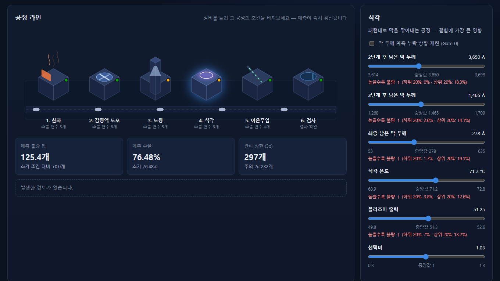
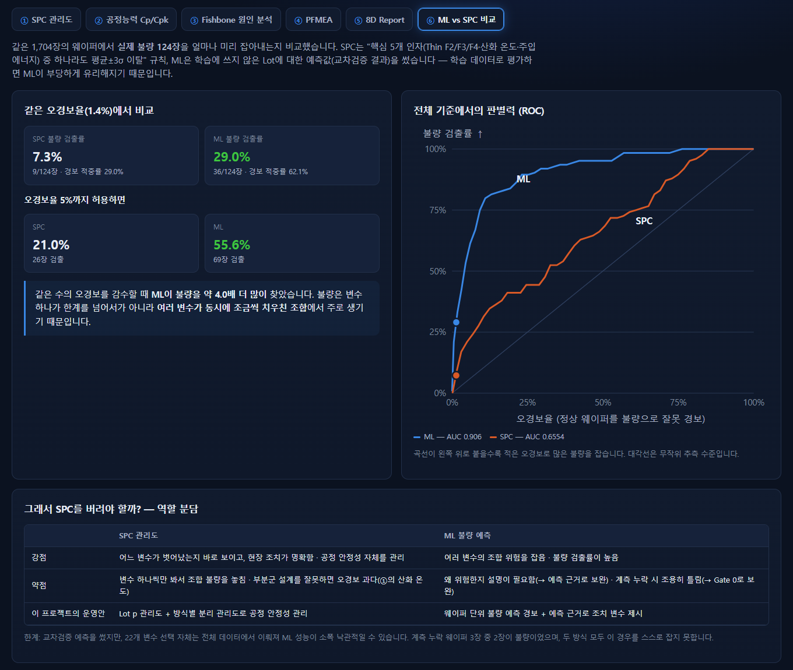
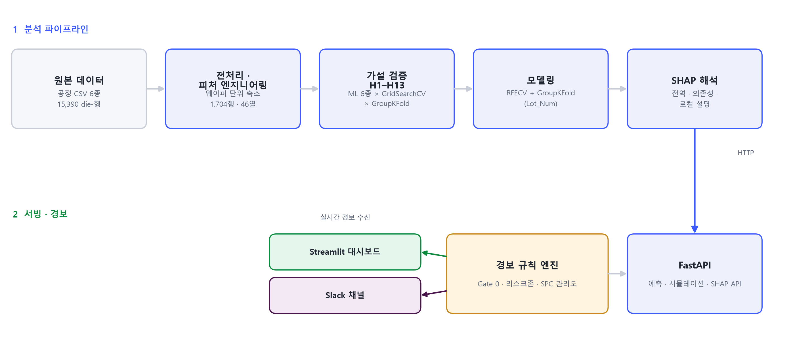
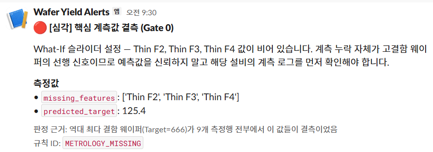

# 웨이퍼 수율 예측 및 이상 탐지 시스템

### 🚀 [대시보드 바로가기 → jihoon0915-gif.github.io/Wafer_Yield_Prediction](https://jihoon0915-gif.github.io/Wafer_Yield_Prediction/)

데이터 업로드 → 불량 예측 · 2.5D 공정 라인에서 조건 조절 · SPC / Cp·Cpk / Fishbone / PFMEA / 8D / ML vs SPC 품질 분석까지
설치 없이 브라우저에서 바로 동작합니다(모델 추론과 예측 근거 계산도 브라우저 안에서 실행).

<sub>백엔드 버전(FastAPI + 실제 Slack 알림 전송): [wafer-yield-prediction.streamlit.app](https://wafer-yield-prediction.streamlit.app/) — 무료 호스팅 특성상 오래 접속이 없으면 잠들어 첫 접속 시 깨우는 데 1분 정도 걸릴 수 있습니다.</sub>

반도체 양산 공정 데이터를 **가설 검증 → 통계적 이상 탐지 → SHAP 기반 근본원인분석**으로
이어지는 품질 데이터 분석 체계로 구축한 프로젝트입니다. 통계적 공정관리(SPC) 관리도
기준으로 결함 이상 징후를 실시간 포착해 Slack으로 경보하고, 계측 결측처럼 데이터 자체의
신뢰도 문제까지 별도 조기경보 규칙으로 관리합니다. 분석 결과는 REST API와 대시보드로
패키징해 검사·품질보증 실무자가 바로 확인·활용할 수 있는 형태로 제공합니다.


<p align="center">
  
</p>
<p align="center"><sub>공정 라인: 장비를 눌러 조건을 바꾸면 예측 불량·수율·경보·예측 근거가 즉시 갱신되고, '최적 조건 찾기'가 개선 조합을 제안</sub></p>

<p align="center">
  
</p>
<p align="center"><sub>품질 분석: SPC 관리도 · 공정능력 · Fishbone · PFMEA · 8D · ML vs SPC 비교 (그림은 ML vs SPC)</sub></p>

---

## 1. 핵심 성과

| 항목 | 결과 |
|---|---|
| 최종 모델 | LightGBM (RFECV로 42개 중 22개 피처 선택) |
| 검증 방식 | **GroupKFold(Lot_Num)** — 학습에 없던 새 Lot 기준 |
| 불량 웨이퍼 판별력 | **AUC 0.906** (교차검증 · 기존 SPC 0.655) |
| 불량 칩 수 예측 | R² 0.4699 ± 0.1603 · MAE 27.59 — 새 Lot 기준의 엄격한 값 |
| 검증한 가설 | 13개 — 원본 7 + 파생변수 6, 각각 ML 6종 × GridSearchCV로 개별 검증 |
| 관리구간 적용 효과 | Chip Yield 80.66% → **81.61% (+0.94%p)** |
| 이상 Lot 탐지 | 32개 Lot 백테스트에서 실제 이상 Lot 1건 탐지, **오탐 0건** |
| ML vs 기존 SPC | 같은 오경보율(1.4%)에서 불량 검출률 **ML 29.0% vs 개별 변수 3σ SPC 7.3%** (교차검증 · AUC 0.906 vs 0.655) |
| 공정능력 | 회로 선폭 Cpk **0.40**, 산화막 두께 Cpk **0.46** — 규격 기반 계산, 모두 1.33 미달 |

> 불량 칩 개수를 정확히 맞히는 것보다 **불량 웨이퍼를 가려내는 게 실무에서 더 중요합니다.** 그 기준인 판별력은
> AUC 0.906으로 높습니다. R² 0.47은 학습에 쓰지 않은 Lot으로 검증한 값으로, 같은 데이터를 흔한 방식으로 검증하면
> 웨이퍼 중복 기록(데이터 누수) 때문에 0.98까지 부풀려집니다 — 부풀리지 않은 숫자를 택했습니다.
| 실시간 경보 | 계측 결측 · 리스크존 진입 · 예측 관리상한(SPC) 초과 3종 → Slack 자동 전송 |

## 2. 핵심 발견

- **데이터 누수 발견 및 제거.** die 단위 반복행을 독립 관측치로 취급하면
  R²가 0.945~0.985까지 부풀려집니다(반복행 89.2%가 그룹 내 타깃 분산 0). 웨이퍼 단위로
  축소하고 GroupKFold(Lot_Num)로 재검증한 **0.4699**가 신뢰할 수 있는 성능입니다.
- **통계적 착시 파악.** 노광 파장이 결함에 영향을 준다는 초기 신호(+20.1%,
  p<0.0001)는 특정 Lot(불량률 61.1%)의 교란이었습니다. 통계·ML 10개 모델로 Lot을 완전히
  통제해 재검증한 결과 유의한 모델은 0개 — 공정 변경 권고 전 반드시 걸러야 했던 신호입니다.
- **조치 가능한 관리 구간 정량화.** 식각 2단계 잔막 두께가 하위 20% 구간이면
  불량률 0.0%, 상위 20% 구간이면 18.4%로 갈립니다. 이 관리구간을 적용한 시뮬레이션에서
  Chip Yield가 +0.94%p 개선됨을 실측 데이터로 확인했습니다.
- **계측 결측 사각지대 발견.** 역대 최다 결함 웨이퍼(666개)의 핵심 예측
  변수가 9개 측정행 전부 결측이었고, 모델은 이를 중앙값으로 조용히 대치해 예측값이
  정상처럼 보였습니다. 그래서 **결측 발생 자체를 경보 신호로 만드는 Gate 0 규칙**을
  구현했습니다.

> 발견의 도출 과정과 근거 수치는 [`reports/FINAL_PROJECT_REPORT.md`](reports/FINAL_PROJECT_REPORT.md)에 전부 정리했습니다.

## 3. 시스템 구성

<p align="center">
  
</p>

프런트엔드는 백엔드와 HTTP로만 통신하므로 API를 같은 프로세스에 두든 별도 호스트에
두든 동일하게 동작합니다. 단일 프로세스로 실행하면 대시보드가 API를 백그라운드
스레드로 자동 기동합니다(포트를 하나만 열어주는 호스팅 환경 대응).

## 4. 이상 탐지 및 Slack 알림

<p align="center">
  
</p>
<p align="center"><sub>What-If 시뮬레이션에서 계측 결측 상황을 재현했을 때 실제 전송된 경보</sub></p>

경보 규칙 3종은 모두 **실제로 검증한 결과**에 근거하며, 임계값은 하드코딩이 아니라
학습 데이터에서 계산됩니다. 매 예측/시뮬레이션 요청마다 평가되고, 발생 시 Slack으로
전송됩니다.

| 규칙 | 심각도 | 발동 조건 | 판정 근거 |
|---|---|---|---|
| `METROLOGY_MISSING` | 심각 | Thin F2/F3/F4 중 결측 발생 | 최다 결함 웨이퍼가 9개 측정행 전부 결측이었음 |
| `ETCH_RISK_ZONE` | 경고 | 세 값이 모두 상위 20% 구간 | 해당 구간 불량률 18.4% vs 하위 20% 구간 0.0% |
| `PREDICTED_TARGET_UCL` | 경고(2σ) / 심각(3σ) | 예측 결함수 > μ+kσ (232.5 / 297.2) | 웨이퍼 단위 SPC 관리도 (μ=103.1, σ=64.7) |

구현 시 고려한 점: 경보 판정과 Slack 전송을 분리해 웹훅이 없어도 규칙은 항상 동작·기록되고,
동일 경보는 5분간 중복 억제하며, 전송은 `BackgroundTasks`로 응답 이후 처리해 추론
지연을 유발하지 않고, 전송 실패가 추론 자체를 막지 않도록 예외를 흡수합니다.

<details>
<summary>Slack 연동 설정 방법</summary>

1. [api.slack.com/apps](https://api.slack.com/apps) → **Create New App** → From scratch
2. **Incoming Webhooks** 활성화 → **Add New Webhook to Workspace** → 알림 받을 채널 선택
3. 발급된 `https://hooks.slack.com/services/...` URL을 환경변수로 지정

   ```bash
   cp .env.example .env        # SLACK_WEBHOOK_URL 값 입력
   ```

   Streamlit Community Cloud에 배포한 경우에는 `.env` 대신 앱 관리 화면의
   **Settings → Secrets**에 같은 키를 TOML 형식으로 넣습니다.

4. 대시보드 사이드바의 **테스트 메시지 전송** 버튼 또는 `POST /alerts/test`로 검증합니다.

</details>

## 5. 분석 방법론

| 단계 | 내용 |
|---|---|
| 1. 1차 벤치마크 | 회귀 5종 + 분류 3종, SHAP 원인분석, 베이지안 최적화·유전 알고리즘 기반 공정 최적화 |
| 2. 자체 감사 | imputation 누수, 근거 없는 챔피언 모델 선정, Lot 교란변수를 스스로 발견해 수정 |
| 3. 가설 검증 H1–H7 | UV_type 교란, die 반복행 누수 등 7개 가설을 ML 6종 × GridSearchCV × GroupKFold로 검증 |
| 4. 파생변수 재검증 H8–H13 | 유의성 검증 없이 만들었던 파생변수 7개를 사후 검증 (2개 채택, 5개 기각) |
| 5. 최종 모델링 | RFECV 피처 선택 + GridSearchCV 튜닝을 GroupKFold(Lot_Num)로 평가 |
| 6. 해석 및 서빙 | SHAP 전역/의존성/로컬 설명 → FastAPI → Streamlit 대시보드 + Slack 경보 |

각 가설의 개별 결과는 [`reports/hypothesis_H{1~13}_result.md`](reports/), 종합 결론은
[`reports/FINAL_PROJECT_REPORT.md`](reports/FINAL_PROJECT_REPORT.md), 공정 개선 전략은
[`reports/PROCESS_OPTIMIZATION_STRATEGY.md`](reports/PROCESS_OPTIMIZATION_STRATEGY.md)에
정리했습니다.

## 6. 기술 스택

| 계층 | 기술 |
|---|---|
| 데이터 처리 | pandas, numpy, pyarrow |
| 모델링 | scikit-learn, LightGBM, XGBoost, CatBoost, TabNet |
| 피처 선택 · 튜닝 | RFECV, GridSearchCV, Optuna |
| 검증 설계 | GroupKFold, RepeatedKFold, 불균형 처리(SMOTE) |
| 통계 검증 | scipy, statsmodels (OLS 고정효과, 혼합효과모형) |
| 모델 해석 | SHAP (TreeExplainer) |
| 백엔드 | FastAPI, Uvicorn (비동기 시뮬레이션 엔드포인트) |
| 프런트엔드 | Streamlit, Plotly |
| 알림 | Slack Incoming Webhook (Block Kit) |

## 7. 시작하기

```bash
python -m venv .venv
source .venv/bin/activate          # Windows: .venv\Scripts\activate
pip install -r requirements.txt

streamlit run app_ui.py            # http://localhost:8501 — API가 없으면 자동 기동
```

정적 대시보드(`docs/`)는 모델·품질 데이터를 JSON으로 내보내 브라우저에서 추론합니다. 모델을 다시 학습했다면
`python scripts/14_export_web_dashboard.py`로 재생성합니다(브라우저 추론은 Python 결과와 오차 1e-13 이내로 검증).

분석 파이프라인 재현, 전체 API 명세, Streamlit Cloud 배포, 폴더 구조는
[`reports/SYSTEM_SETUP_GUIDE.md`](reports/SYSTEM_SETUP_GUIDE.md)에 정리했습니다.

---

## 라이선스

개인 학습·포트폴리오 목적으로 공개한 프로젝트입니다. 모델 한계와 해석 시 주의사항은
[`reports/FINAL_PROJECT_REPORT.md`](reports/FINAL_PROJECT_REPORT.md#7-알려진-한계)에
정리했습니다.
