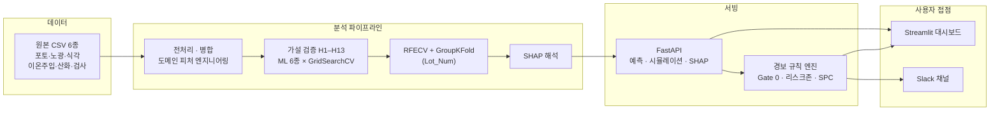

# 웨이퍼 수율 예측 및 이상 탐지 시스템

[](https://wafer-yield-prediction.streamlit.app/)

### 🚀 [라이브 데모 바로가기 → wafer-yield-prediction.streamlit.app](https://wafer-yield-prediction.streamlit.app/)

반도체 6개 공정 데이터를 통합해 웨이퍼 결함 다이 수를 예측하고, 예측 근거를 SHAP으로 분해해
공정 엔지니어가 바로 조치할 수 있는 형태로 제공하는 엔드투엔드 시스템입니다.
분석에서 그치지 않고 REST API · 인터랙티브 대시보드 · Slack 실시간 경보까지 구현했습니다.


---

## 1. 문제 정의와 결론

반도체 수율 분석에서 가장 흔한 실패는 **성능이 좋아 보이는 모델을 만드는 것**입니다.
이 프로젝트는 그 반대 방향으로 진행했습니다. 초기 모델의 R²는 0.98이었지만, 검증 설계를 바로잡자
0.47로 내려갔습니다. 이 프로젝트의 핵심 기여는 **0.47이 진짜 숫자라는 것을 증명한 과정**과,
그 위에서 실제로 조치 가능한 공정 인자를 특정한 것입니다.

| 항목 | 결과 |
|---|---|
| 최종 모델 | LightGBM (RFECV로 42개 중 22개 피처 선택) |
| 검증 방식 | **GroupKFold(Lot_Num)** — 학습에 없던 새 Lot 기준 |
| 성능 | **R² 0.4699 ± 0.1603 · MAE 27.59** |
| 비교 모델 | RandomForest 0.4677 (32피처) · XGBoost 0.4500 (38피처) |
| 데이터 | 1,704 웨이퍼 / 15,390 die 행 / 6개 공정 |
| 검증한 가설 | 13개 (원본 7 + 파생변수 6, 각각 ML 6종 × GridSearchCV) |
| 시뮬레이션 효과 | Chip Yield 80.66% → **81.61% (+0.94%p)** |
| Lot 이상 탐지 | 32개 Lot 백테스트에서 실제 이상 Lot 1건 탐지, **오탐 0건** |

---

## 2. 핵심 발견

### 데이터 누수를 실증하고 제거했다
die 단위 반복행(15,390행)을 독립 관측치로 취급하면 R²가 **0.945–0.985**까지 나옵니다.
원인은 반복행의 **89.2%가 그룹 내 타깃 분산이 0**이기 때문 — 같은 웨이퍼가 여러 행에 중복 기록되어
같은 정답이 학습셋과 검증셋에 동시에 들어갑니다. 웨이퍼 단위(1,704행)로 축소하고
GroupKFold(Lot_Num)로 재검증한 **0.4699**가 신뢰할 수 있는 성능입니다.

### 통계적 착시를 걷어냈다
노광 파장(UV_type)이 결함에 영향을 준다는 초기 결과(H-line vs G/I-line **+20.1%**, p<0.0001)는
**특정 Lot(불량률 61.1%)이 UV_type을 단일값으로 사용하는 교란**이었습니다.
통계모델 4종 + ML 6종, 총 **10개 모델로 Lot을 완전히 통제해 재검증한 결과 유의한 모델은 0개**였습니다.
공정 변경 권고를 내리기 전에 반드시 걸러야 했던 신호입니다.

### 조치 가능한 관리 구간을 정량화했다
식각 2단계 잔막 두께(Thin F2)가 **하위 20% 구간(≤3,638nm)일 때 불량률 0.0%**,
**상위 20% 구간(≥3,666nm)일 때 18.4%** 로 갈립니다. 이 관리 구간을 적용한 시뮬레이션에서
Chip Yield가 **+0.94%p** 개선됨을 실측 데이터로 확인했습니다.

### 계측 결측이라는 사각지대를 찾아냈다
데이터셋 역대 최다 결함 웨이퍼(결함 666개)를 SHAP으로 역추적한 결과, 핵심 예측 변수인
Thin F2/F3/F4가 **9개 측정 행 전부에서 결측(NaN)** 이었습니다.
결함이 심각한 웨이퍼일수록 계측 자체가 누락되는 구조입니다.

문제는 모델이 이 결측을 중앙값으로 조용히 대치한다는 점입니다. 계측값만 비운 채 예측을 요청하면
**결함 125개** — 계측이 정상인 웨이퍼와 구분되지 않는 값이 반환됩니다. 즉 예측값만 봐서는
계측 누락을 알아챌 수 없습니다. 그래서 결측을 메우는 대신
**결측 발생 자체를 경보 신호로 만드는 Gate 0 규칙**을 시스템에 구현했습니다
(대시보드 사이드바의 *계측 결측 상황 재현* 토글로 직접 확인할 수 있습니다).

---

## 3. 시스템 구성



프런트엔드는 백엔드와 **HTTP로만 통신**하므로, API를 같은 프로세스에 두든 별도 호스트에 두든
동일하게 동작합니다. 단일 프로세스로 실행하면 대시보드가 API를 백그라운드 스레드로 기동합니다
(포트를 하나만 열어주는 호스팅 환경 대응).

---

## 4. 이상 탐지 및 Slack 알림

경보 규칙 3종은 모두 이 프로젝트에서 **실제로 검증한 결과**에 근거하며, 임계값은 하드코딩이 아니라
학습 데이터에서 계산됩니다. 매 예측/시뮬레이션 요청마다 평가되고, 발생 시 Slack으로 전송됩니다.

| 규칙 | 심각도 | 발동 조건 | 판정 근거 |
|---|---|---|---|
| `METROLOGY_MISSING` | 심각 | Thin F2/F3/F4 중 결측 발생 | 최다 결함 웨이퍼가 9개 측정행 전부 결측이었음 |
| `ETCH_RISK_ZONE` | 경고 | 세 값이 모두 상위 20% 구간 | 해당 구간 불량률 18.4% vs 하위 20% 구간 0.0% |
| `PREDICTED_TARGET_UCL` | 경고(2σ) / 심각(3σ) | 예측 결함수 > μ+kσ (232.5 / 297.2) | 웨이퍼 단위 SPC 관리도 (μ=103.1, σ=64.7) |

구현 시 고려한 점:

- **경보 판정과 전송을 분리** — 웹훅이 없어도 규칙은 항상 동작하고 이력에 기록됩니다
  (`src/wafer/alerting.py` = 규칙, `src/wafer/slack.py` = 전송).
- **중복 억제** — 대시보드 슬라이더는 조작할 때마다 API를 호출하므로, 동일 경보는 5분간 억제합니다.
- **전송은 응답 이후에** — FastAPI `BackgroundTasks`로 처리해 웹훅 왕복시간이 추론 응답을 지연시키지 않습니다.
- **알림 실패가 추론을 막지 않음** — 전송 예외는 로깅 후 흡수합니다.

### Slack 연동 설정

1. [api.slack.com/apps](https://api.slack.com/apps) → **Create New App** → From scratch
2. **Incoming Webhooks** 활성화 → **Add New Webhook to Workspace** → 알림 받을 채널 선택
3. 발급된 `https://hooks.slack.com/services/...` URL을 환경변수로 지정

```bash
cp .env.example .env        # SLACK_WEBHOOK_URL 값 입력
```

Streamlit Community Cloud에 배포한 경우에는 `.env` 대신 앱 관리 화면의
**Settings → Secrets**에 아래 내용을 넣습니다.

```toml
SLACK_WEBHOOK_URL = "https://hooks.slack.com/services/..."
SLACK_ALERT_MIN_SEVERITY = "warning"
```

설정 후 대시보드 사이드바의 **테스트 메시지 전송** 버튼 또는 `POST /alerts/test`로 검증할 수 있습니다.

---

## 5. 분석 방법론

| 단계 | 내용 |
|---|---|
| 1. 1차 벤치마크 | 회귀 5종(RF/XGBoost/LightGBM/CatBoost/MLP) + 분류 3종(SMOTE+RF/Cost-Sensitive LightGBM/TabNet), SHAP 원인분석, 베이지안 최적화·유전 알고리즘·SLSQP 기반 공정 최적화 |
| 2. 자체 감사 | imputation 누수, 근거 없는 챔피언 모델 선정, 불공정한 하이퍼파라미터 튜닝, Lot 교란변수를 스스로 발견해 수정 |
| 3. 가설 검증 H1–H7 | UV_type 교란, die 반복행 누수, 식각 구간차분, 결측 정보 보존, 챔버 효과, 시간 드리프트, type/Vapor를 회귀 ML 6종 × GridSearchCV × GroupKFold로 개별 검증 |
| 4. 파생변수 재검증 H8–H13 | 유의성 검증 없이 만들었던 파생변수 7개를 사후 검증 (2개 채택, 5개 기각) |
| 5. 최종 모델링 | RFECV 피처 선택 + GridSearchCV 튜닝을 GroupKFold(Lot_Num)로 평가 |
| 6. 해석 및 서빙 | SHAP 전역/의존성/로컬 설명 → FastAPI → Streamlit 대시보드 + Slack 경보 |

각 가설의 개별 결과는 [`reports/hypothesis_H{1~13}_result.md`](reports/), 종합 결론은
[`reports/FINAL_PROJECT_REPORT.md`](reports/FINAL_PROJECT_REPORT.md),
공정 개선 전략은 [`reports/PROCESS_OPTIMIZATION_STRATEGY.md`](reports/PROCESS_OPTIMIZATION_STRATEGY.md)에 정리했습니다.

---

## 6. 기술 스택

| 계층 | 기술 |
|---|---|
| 데이터 처리 | pandas, numpy, pyarrow |
| 모델링 | scikit-learn, LightGBM, XGBoost, CatBoost, TabNet |
| 피처 선택 · 튜닝 | RFECV, GridSearchCV, Optuna |
| 검증 설계 | GroupKFold, RepeatedKFold, 불균형 처리(SMOTE) |
| 통계 검증 | scipy, statsmodels (OLS 고정효과, 혼합효과모형) |
| 모델 해석 | SHAP (TreeExplainer) |
| 백엔드 | FastAPI, Uvicorn (비동기 시뮬레이션 엔드포인트) |
| 프런트엔드 | Streamlit, Plotly |
| 알림 | Slack Incoming Webhook (Block Kit) |

---

## 7. 실행 방법

```bash
python -m venv .venv
source .venv/bin/activate          # Windows: .venv\Scripts\activate
pip install -r requirements.txt
```

### 대시보드 실행

```bash
streamlit run app_ui.py            # http://localhost:8501
```

API가 떠 있지 않으면 대시보드가 같은 프로세스에서 자동으로 기동합니다.
백엔드를 따로 띄우려면 (API 문서 확인 등):

```bash
uvicorn app_api:app --reload       # http://127.0.0.1:8000/docs
streamlit run app_ui.py            # 다른 터미널
```

### 분석 파이프라인 재현 (선택)

산출물은 이미 `models/`, `reports/`에 포함되어 있습니다.

```bash
pip install -r requirements-dev.txt

python scripts/10_run_all_hypotheses_h1_h13.py   # 가설 H1~H13 전체 검증
python scripts/11_final_preprocessing_pipeline.py
python scripts/12_final_modeling_pipeline.py
python scripts/13_model_interpretation_shap.py
```

### 주요 API

| 엔드포인트 | 설명 |
|---|---|
| `POST /predict` | 단일/배치 웨이퍼 결함 수 예측 (+ 경보 판정) |
| `POST /simulate` | What-If 시뮬레이션 — 변경 전후 예측치와 SHAP 기여도 변화 (비동기) |
| `GET /wafer-shap/{id}` | 실측 웨이퍼 예측 근거를 SHAP Waterfall로 분해 |
| `GET /wafer-map/{id}` | 26×26 die 단위 실측 불량 분포 |
| `GET /alerts` | 최근 경보 이력 |
| `GET /alerts/config` | 경보 임계값 + Slack 연동 상태 |
| `POST /alerts/test` | Slack 웹훅 설정 검증 |

---

## 8. 배포

Streamlit Community Cloud 기준입니다.

1. [share.streamlit.io](https://share.streamlit.io) 접속 → GitHub 계정으로 로그인
2. **New app** → 이 저장소 선택 → Main file path에 `app_ui.py` 입력
3. **Deploy** 클릭

저장소에 배포에 필요한 설정이 모두 포함되어 있습니다.

| 파일 | 역할 |
|---|---|
| `requirements.txt` | 런타임 의존성만 (모델 pkl 호환성 때문에 버전 고정) |
| `requirements-dev.txt` | 분석 파이프라인 재현용 (배포에는 미사용) |
| `packages.txt` | LightGBM이 요구하는 시스템 패키지(`libgomp1`) |
| `.streamlit/config.toml` | 테마 설정 |

Slack 알림을 켜려면 배포 후 **Settings → Secrets**에 `SLACK_WEBHOOK_URL`을 추가합니다(4절 참고).

API를 별도 호스트에 배포한 경우 `WAFER_API_URL` 환경변수로 지정하면 대시보드가 그쪽을 바라봅니다.

---

## 9. 폴더 구조

```
.
├── data/
│   ├── raw/                        # 원본 공정 CSV 6개
│   └── processed/                  # 병합·전처리 산출물
├── src/wafer/
│   ├── config.py                   # 경로/스펙 상수
│   ├── io.py · integrate.py        # CSV 파싱, No_Die 기준 병합, 웨이퍼맵 복원
│   ├── validate.py                 # 병합 결과 회귀 검증(9개 assertion)
│   ├── features.py                 # 도메인 피처 엔지니어링
│   ├── modeling.py                 # GroupKFold CV 러너, 전처리 파이프라인
│   ├── final_pipeline.py           # 최종 피처 목록, 커스텀 transformer
│   ├── alerting.py                 # 경보 규칙 엔진 + 이력 버퍼
│   └── slack.py                    # Slack Incoming Webhook 전송
├── scripts/
│   ├── 02~06_*.py                  # 1차 벤치마크: 회귀/분류/XAI/최적화/시뮬레이션
│   ├── 07_domain_master_dataset.py
│   ├── 08~09_h1_*.py               # UV_type 교란 심층 재검증
│   ├── hypothesis_ml_lib.py        # 가설 검증 공용 프레임워크
│   ├── h1~h13_*.py                 # 가설별 검증 스크립트
│   ├── 10_run_all_hypotheses_h1_h13.py
│   ├── 11_final_preprocessing_pipeline.py
│   ├── 12_final_modeling_pipeline.py
│   └── 13_model_interpretation_shap.py
├── models/                         # 배포 파이프라인 + 후보 모델 3종
├── reports/                        # 단계별 리포트(md/csv/png)
│   ├── FINAL_PROJECT_REPORT.md
│   ├── PROCESS_OPTIMIZATION_STRATEGY.md
│   ├── hypothesis_H{1~13}_result.md
│   └── figures/
├── app_api.py                      # FastAPI 백엔드
├── app_ui.py                       # Streamlit 대시보드
└── .env.example                    # 환경변수 템플릿
```

---

## 10. 모델 한계

- **R² 0.47은 새 Lot 기준의 보수적 추정치**입니다. 웨이퍼 단위 무작위 분할이라면 0.6–0.7 수준이지만,
  실제 운영에서는 학습에 없던 Lot을 만나므로 GroupKFold(Lot_Num) 기준을 채택했습니다.
- **SHAP 기여도는 인과관계가 아닙니다.** UV_type처럼 교란변수를 통제하자 사라진 신호가 실제로 있었습니다.
  공정 변경 전 해당 가설 리포트를 교차 확인해야 합니다.
- **결측 구간의 예측은 신뢰도가 낮습니다.** 모델이 결측을 중앙값으로 대치하므로 예측값이 정상으로
  보일 수 있습니다. Gate 0 경보가 발생하면 예측값이 아니라 계측 로그를 먼저 확인해야 합니다.
- 원본 데이터 특성상 웨이퍼맵의 **17%는 절단되어 복구할 수 없습니다.**

---

## 라이선스

개인 학습·포트폴리오 목적으로 공개한 프로젝트입니다.
