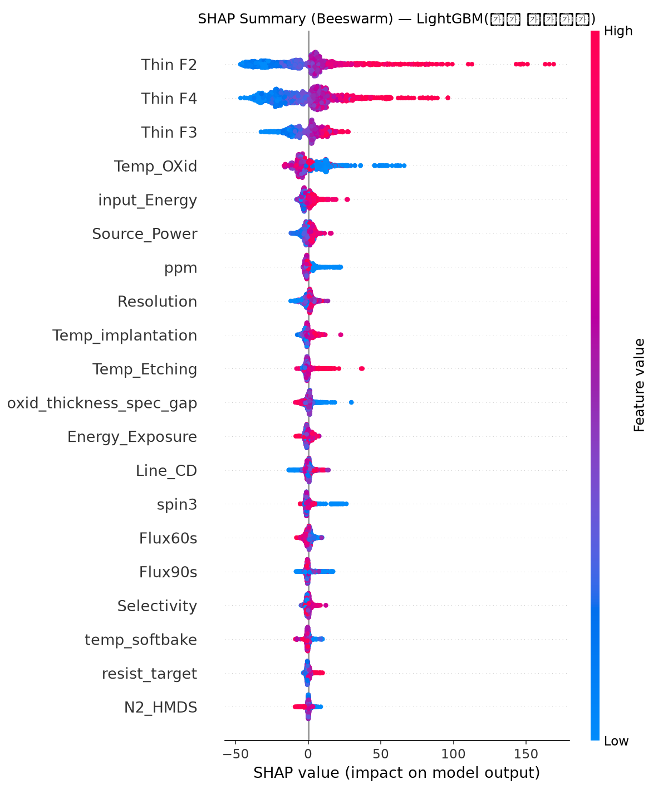
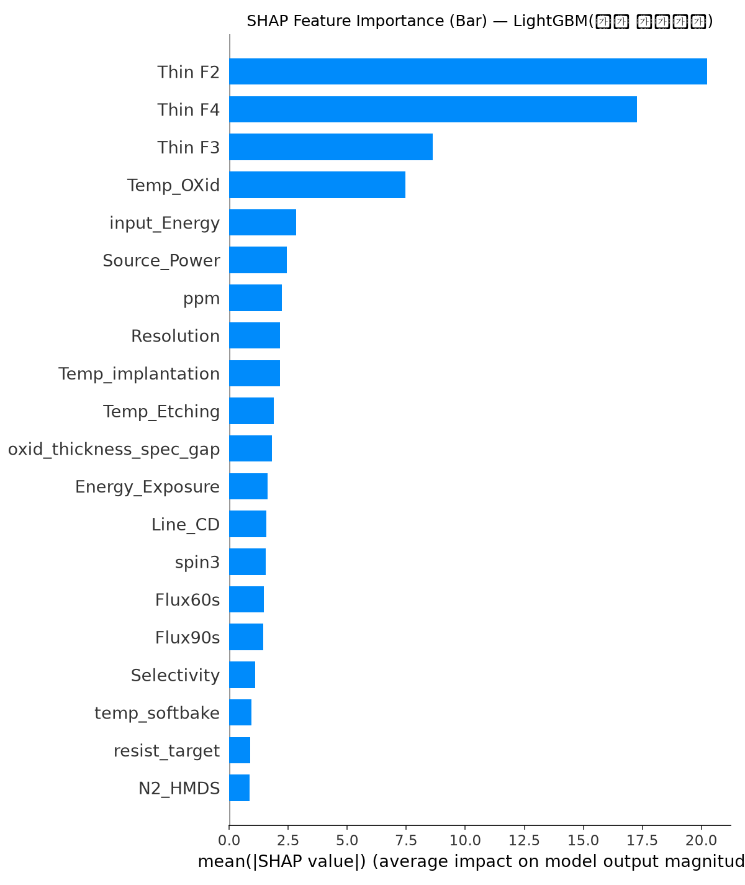
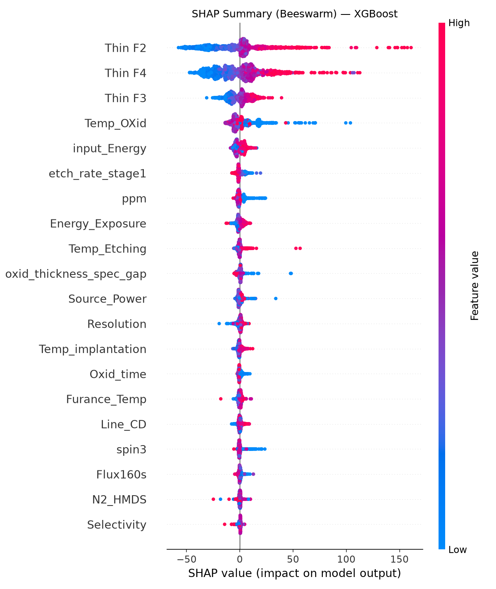
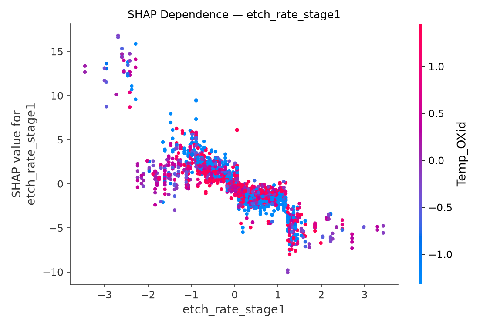
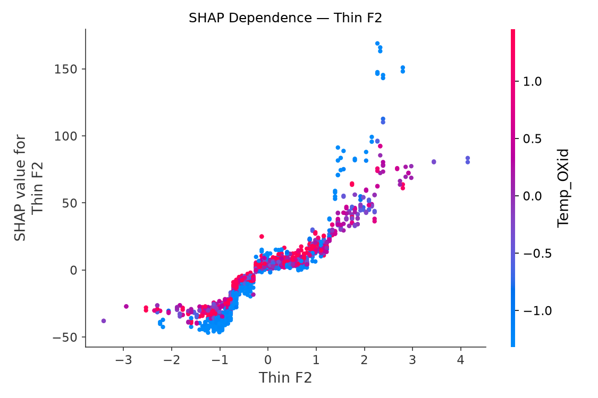
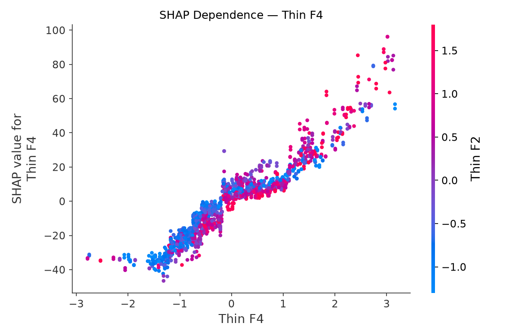
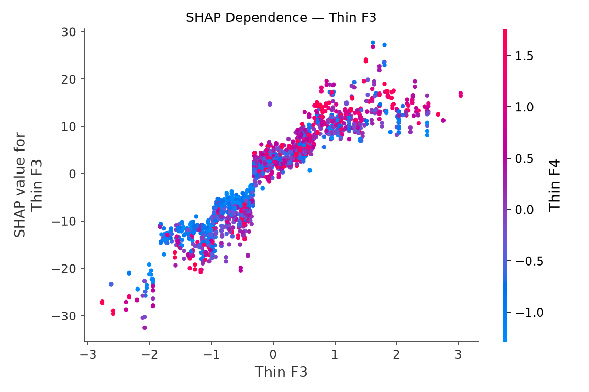
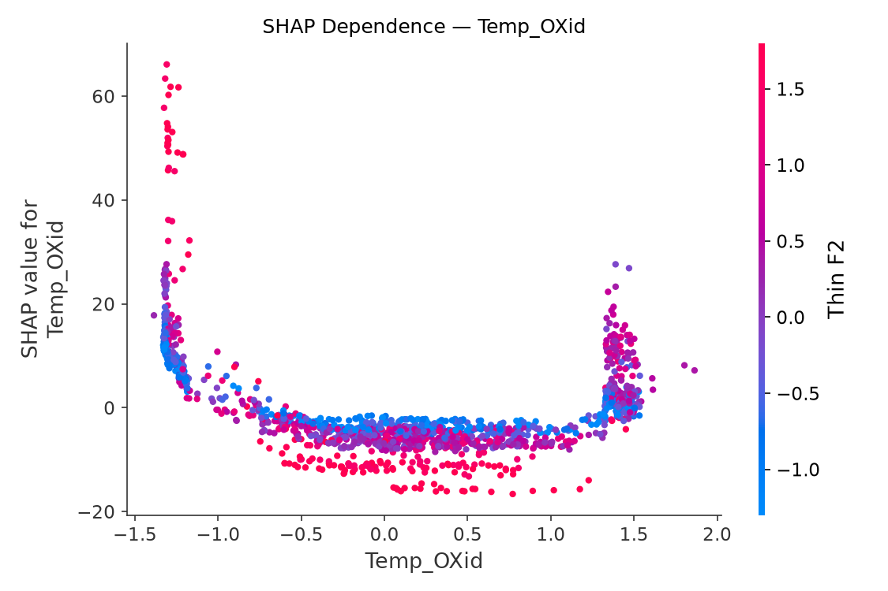
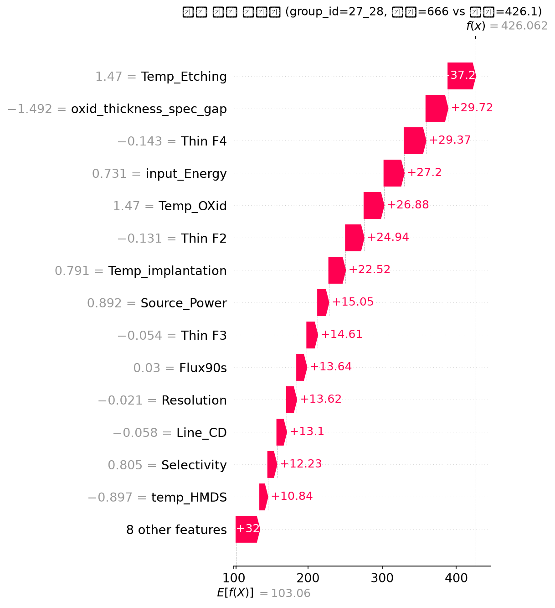
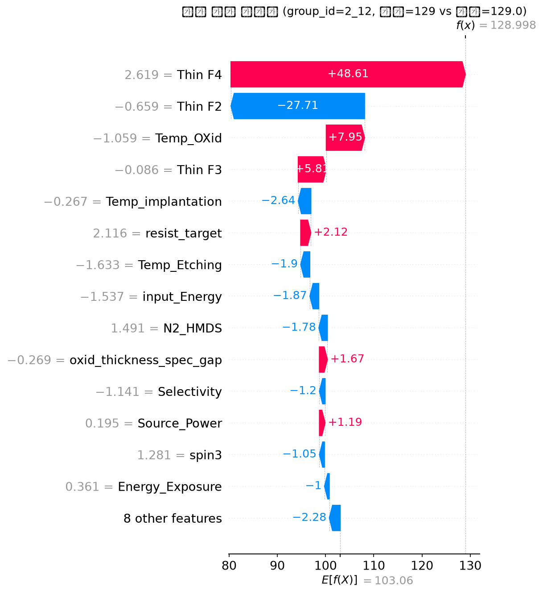

# 모델 해석(XAI) 보고서 — SHAP 기반 분석

최종 배포 모델 **LightGBM**(22개 피처, GroupKFold(Lot_Num) CV R²=0.4699±0.1603)과 비교 모델 **XGBoost**(38개 피처, R²=0.4500±0.1741)에 대해 SHAP(TreeExplainer)으로 예측 근거를 분석했다. 전체 1,704개 웨이퍼(fit에 쓰인 것과 동일 데이터)에 대해 계산했다 — SHAP은 '모델이 무엇을 학습했는가'를 설명하는 도구이지 별도의 일반화 성능 검증이 아니므로, 성능 수치 자체는 `final_modeling_report.md`의 GroupKFold 결과를 봐야 한다.

## 1. 글로벌 영향도 (SHAP Summary)

**LightGBM 상위 10개 피처 (mean|SHAP|)**

| 순위 | 피처 | mean|SHAP| |
|---|---|---|
| 1 | `Thin F2` | 20.244 |
| 2 | `Thin F4` | 17.273 |
| 3 | `Thin F3` | 8.612 |
| 4 | `Temp_OXid` | 7.461 |
| 5 | `input_Energy` | 2.828 |
| 6 | `Source_Power` | 2.452 |
| 7 | `ppm` | 2.224 |
| 8 | `Resolution` | 2.153 |
| 9 | `Temp_implantation` | 2.144 |
| 10 | `Temp_Etching` | 1.892 |

**XGBoost 상위 10개 피처 (mean|SHAP|)**

| 순위 | 피처 | mean|SHAP| |
|---|---|---|
| 1 | `Thin F2` | 19.894 |
| 2 | `Thin F4` | 18.243 |
| 3 | `Thin F3` | 7.603 |
| 4 | `Temp_OXid` | 7.355 |
| 5 | `input_Energy` | 3.266 |
| 6 | `etch_rate_stage1` | 2.356 |
| 7 | `ppm` | 2.123 |
| 8 | `Energy_Exposure` | 1.919 |
| 9 | `Temp_Etching` | 1.416 |
| 10 | `oxid_thickness_spec_gap` | 1.414 |

### XGBoost vs LightGBM 비교 해석

두 모델 상위 10개 중 **7개가 공통**(`Temp_Etching`, `Temp_OXid`, `Thin F2`, `Thin F3`, `Thin F4`, `input_Energy`, `ppm`) — 서로 다른 피처 부분집합(42개 중 XGBoost 38개 vs LightGBM 22개)과 다른 알고리즘으로 학습했음에도 핵심 신호는 일치한다는 뜻으로, 특정 알고리즘의 우연이 아니라 실제 공정 신호로 볼 근거가 된다.
- LightGBM에만 있는 상위피처: `Resolution`, `Source_Power`, `Temp_implantation` — 두 모델의 RFECV가 서로 다른 피처 수(38 vs 22)를 골랐기 때문에 생기는 차이다. 성능 차이가 거의 없다는 걸 감안하면, 이 변수들은 '있으면 미세하게 도움' 수준이지 필수 신호는 아닐 가능성이 있다.
- XGBoost에만 있는 상위피처: `Energy_Exposure`, `etch_rate_stage1`, `oxid_thickness_spec_gap`

## 2. 핵심 공정 변수 의존성 분석 (H3 포함)

`etch_rate_stage1`(H3에서 채택된 식각 1단계 구간차분, Thin F1-F2)의 SHAP 의존성 그래프 — 이전 EDA에서 확인한 상관(r=-0.39, 값이 클수록 결함↓)의 방향이 SHAP 관점에서도 유지되는지 시각적으로 확인할 것.

## 3. 로컬 해석 (개별 웨이퍼)

⚠️ 아래 Waterfall 그림 자체에는 SHAP/matplotlib 특성상 피처값이 StandardScaler로 스케일된 z-score로 표시된다(예: `Temp_OXid = 1.49`는 '평균보다 1.49 표준편차 높다'는 뜻이지 실제 1.49℃가 아님). 원본 물리단위 실측값은 그림 아래 표를 봐야 한다.

**오차 최대 웨이퍼** — group_id=`27_28`(Lot 27): 실제 Target=666(데이터셋 전체 역대 최댓값), 예측=426.1 (오차 +239.9, 대폭 과소예측)

🔴 **데이터 결함 발견**: 이 웨이퍼는 `Thin F2/F3/F4`(식각 잔막 실측값)가 9개 die-행 전부에서 **완전히 결측**(NaN, 단순 센티널 0이 아니라 값 자체가 없음)이다 — `raw/Etching.csv` 원본부터 결측이라 이 프로젝트 전처리 단계의 버그가 아니다. 즉 모델이 이 웨이퍼를 크게 과소예측(408.9 vs 실제 666)한 이유는 '모델이 틀렸다'가 아니라 **'가장 강력한 예측 신호(Thin F2/F4, SHAP 1·2위)가 이 웨이퍼에서만 통째로 없어서 중앙값으로 대체된 값을 쓸 수밖에 없었다'는 것이다. 실무적으로 훨씬 중요한 시사점: **결함이 가장 심각한 웨이퍼일수록 계측 자체가 누락되는 경향**이 있을 수 있다는 뜻이다(계측 장비가 손상이 심한 웨이퍼를 스킵했거나, 손상이 너무 심해 정상 계측이 불가능했을 가능성). 이 가설이 맞다면, 현재 모델은 '가장 위험한 웨이퍼일수록 가장 못 맞히는' 구조적 사각지대를 갖고 있다는 뜻이라 — 계측 누락 자체를 결함 조기경보 신호로 별도 관리하는 걸 권장한다(Top 5 KPI 다음으로 우선순위가 높은 실무 제언).

이 웨이퍼의 예측을 가장 크게 밀어올리거나 끌어내린 상위 5개 피처:

| 피처 | SHAP 기여도 | 실측값(원본 단위) |
|---|---|---|
| `Temp_Etching` | +37.27 | 72.336 |
| `oxid_thickness_spec_gap` | +29.72 | -22.94000000000005 |
| `Thin F4` | +29.37 | nan |
| `input_Energy` | +27.20 | 32437.917 |
| `Temp_OXid` | +26.88 | 1289.65 |

**정확 예측 웨이퍼** — group_id=`2_12`(Lot 2): 실제 Target=129, 예측=129.0 (오차 +0.0)

| 피처 | SHAP 기여도 | 실측값(원본 단위) |
|---|---|---|
| `Thin F4` | +48.61 | 620.0 |
| `Thin F2` | -27.71 | 3641.0 |
| `Temp_OXid` | +7.95 | 910.91 |
| `Thin F3` | +5.81 | 1462.0 |
| `Temp_implantation` | -2.64 | 102.721 |

## 4. 공정 제어 우선순위 Top 5 KPI

| 우선순위 | 피처 | mean|SHAP| | 근거 |
|---|---|---|---|
| 1 | `Thin F2` | 20.244 | SHAP Dependence Plot(2절) 및 로컬 설명(3절) 참고 |
| 2 | `Thin F4` | 17.273 | SHAP Dependence Plot(2절) 및 로컬 설명(3절) 참고 |
| 3 | `Thin F3` | 8.612 | SHAP Dependence Plot(2절) 및 로컬 설명(3절) 참고 |
| 4 | `Temp_OXid` | 7.461 | SHAP Dependence Plot(2절) 및 로컬 설명(3절) 참고 |
| 5 | `input_Energy` | 2.828 | SHAP Dependence Plot(2절) 및 로컬 설명(3절) 참고 |

**주의**: 이 순위는 '모델이 예측할 때 무엇을 가장 많이 참고하는가(예측 기여도)'이지, 08/H1~H7 리포트에서 이미 통계적으로 검증한 '실제 인과관계'와 자동으로 같지 않다. 특히 UV_type처럼 예측 기여도가 있어 보여도 Lot 교란 통제 후 사라진 사례가 있었으므로, 이 Top 5를 실제 공정 변경 의사결정에 쓰기 전에는 H1~H7 리포트에서 해당 변수가 이미 인과적으로 검증됐는지 교차확인해야 한다. 여기 상위 피처들(Thin F2-4, etch_rate_stage1, 산화/이온주입 공정변수)은 이미 H3~H4 가설검증과 04_xai_analysis.py의 SHAP 분석에서도 일관되게 상위권이었던 변수들로, 교차검증된 신호로 볼 수 있다.

## 재현

`python scripts/13_model_interpretation_shap.py` (shap, matplotlib 필요)
그림: `reports/figures/shap_*.png`